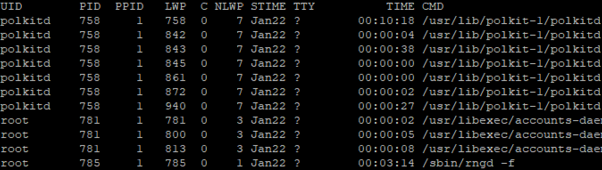

Ps-efL_explained.txt

In this example below, we are using ps (report the current processes) along with -efL flags or options ( -e= select all processes, -f=Do full-format listing, and -L=number of threads and ID)
to view not just processes but threads as well along with other CMDs. You'll notice your word count would be far more than just using "pf -ef". That is because _-L_ option list Number of threads.
A single process can have more than one group of work concurrently by creating one more threads. A single process can have multiple threads. Multi-threaded usually occupy more lines, and there
are additional columns, LWP and NLWP. LWP gives each thread an separate ID, and NLWP states the number of threads. A process accomplishes multiple tasks simultaneously or at the same time, but 
downside to that is since threads share the same memory, they can become slow if the initial process does concurrent tasks.

```
ps -efL | grep user101 |egrep -v 'grep|root' | wc -l
```
```
ps   - (report the current processes)
-efL - flags or options ( -e= select all processes, -f=Do full-format listing, and -L=number of threads and ID)
grep user101 - print line matching or output only user101 from processes
egrep -v 'grep|root' - select non-matching lines using extended grep or excluded the following from grep
wc - print word count
-l - print the newline counts
```
We can determine the difference between single-threaded and multi-threaded processes by their NLWP values.
PIDs 758 have the same number as NLWP, indicating 7 threads, and PID 785 showing 1 NLWP. Also note, 
in a multi-threaded process, only one LWP matches its PID, and the others have different values of LWP.



>Some random and useful information


Processs Related CMDs

nofile - max number of open file descriptors

nproc - max number of processes

cat /etc/security/limits.conf - used to enforce resource limits at a user level. 


user = s105

w | wc -l - how many users are connected 

w | grep s105 | wc -l  - how many s105 users are connected  with #

lsof -u s105|wc -l  - openfile for user s105

ps -ef|grep TEX - To see every process and grep only TEX which happens to follow in CMD column

lsof -u s105 = lists out all the files opened by s105 user. Along with that we can see the type of file here and they are:

`DIR: Directory`

`REG: Regular file`

`CHR: Character special file`


_This is a short read, to get further and better understanding please read on process-vs-thread_
